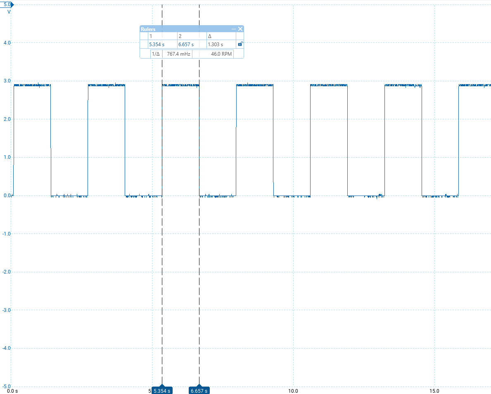

# GPIO blink

## Purpose

First bring-up: configure pins as **GPIO output** and toggle LEDs in software.

Uses `bdk_gpio_init`, `bdk_gpio_toggle` (no timers — delay is a busy loop).

## What it proves

- RCC GPIO clock enable and pin configuration work on **PD12** (green) and **PD14** (red).
- You can see ~1 s toggle on the Discovery LEDs (delay is approximate, not calibrated).

## Hardware

Discovery: PD14 red, PD12 green.

## Probe

- Channel: PD14 or PD12 vs GND — square wave, period set by the delay loop in `main.c`

## Build

`cmake --build build --target gpio_blink`

## Captures

```markdown

```
