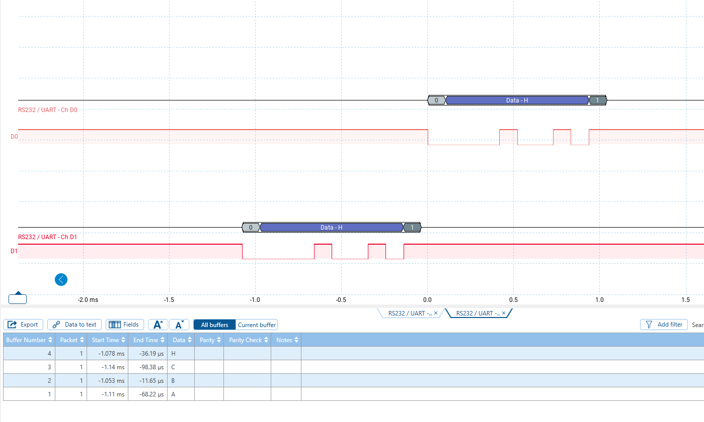

# UART echo

## Purpose

**Polling** full duplex: block on **RXNE**, echo with **write_byte**.

## What it proves

- RX path (PA3) and TX path (PA2) work together.
- Characters typed in Tera Term return on the same terminal.

## Wiring

| Adapter | STM32 |
|---------|--------|
| TX | **PA3** (USART2 RX) |
| RX | **PA2** (USART2 TX) |
| GND | GND |

Tera Term **9600 8N1**. Do not tie PA2–PA3 while the adapter drives those pins.

## Build

`cmake --build build --target uart_echo`

## Captures

```markdown

```
