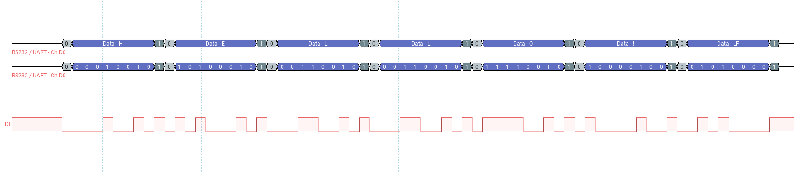

# UART TX

## Purpose

Minimal **polling transmit**: CPU waits on **TXE**, writes **DR** (`bdk_uart_write`).

## What it proves

- USART2 init, GPIO AF on PA2, and baud 9600 work.
- Serial or scope on PA2 shows **`HELLO!`** once after reset.

## Wiring / probe

- USB–UART RX ← **PA2**, GND common; Tera Term **9600 8N1**
- Or scope UART decode on PA2

## Build

`cmake --build build --target uart_tx`

## Captures

```markdown

```
